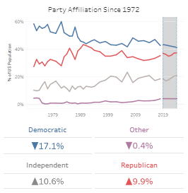
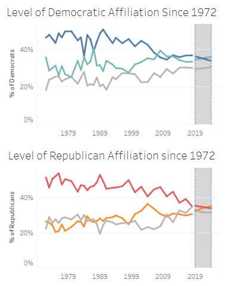
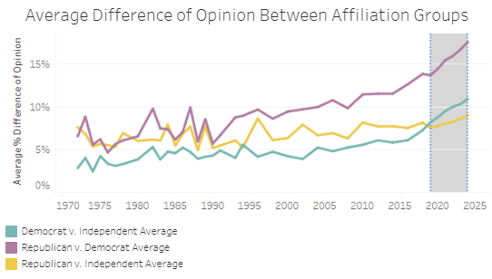
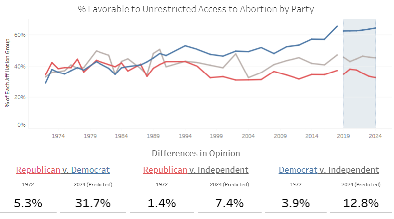
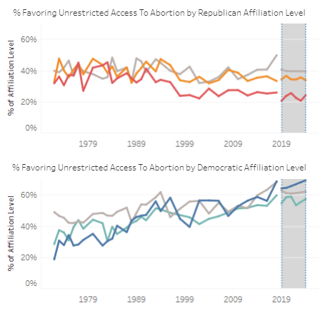
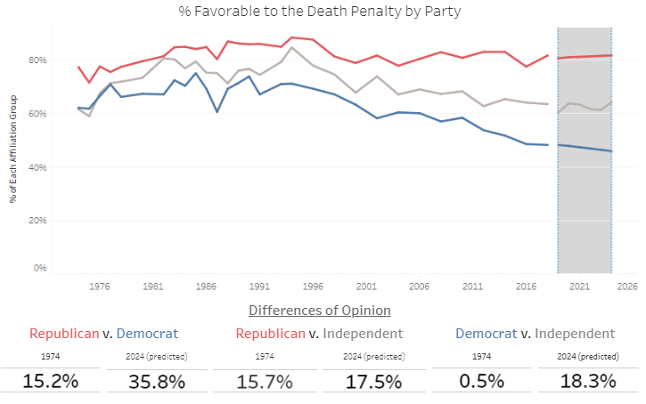
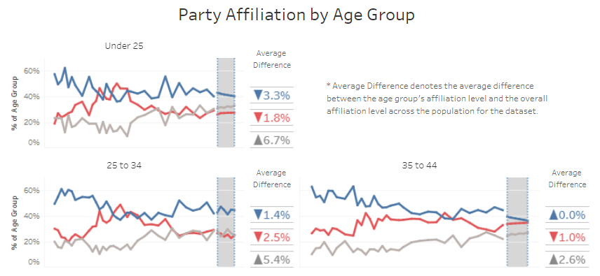
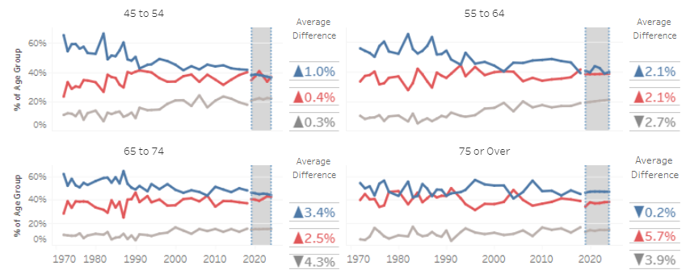

# Faultlines 
by Shawn Sobieski

An analysis of how the two party system has changed in the past fifty years, and A look to the possible future. 

## Methodology
The Faultlines project is based on data collected from the General Social Survey conducted by the University of Chicago. It spans fifty years and over 30 different survey questions. It seeks to look at the divisiveness in American partisan politics through the lens of public opinion to try to discover how people choose to identify with political parties in America, and how those choices affect the parties' identities and values over the last fifty years. 
In addition I applied ARIMA modeling techniques to project into the future, attempting to see what the landscape may be from now until 2024. 
This summary of the project will provide an overview of a few sections that stood out in the analysis and explain what it could mean for the future of partisan politics in America. 
If you are interested in seeing more, please take a look at my github repo with the full version of the project, including the data collected from the General Social Survey. 

### Where do we stand?
Before diving into some more specific examples, its a good idea to take a look at the overall picture of American politics today. Since 1972, affiliation with some form of independent party has risen from 10% to a predicted 21% by 2024, and as a result many of the attitudes that define the parties have hardened to become diametrically opposed. While affiliation with a party is still the norm, people are increasingly identifying with no political party at all.
A huge proportion of this shift has come from democratic party defectors. The exact reasons for this are not explained by the data, but as more and more people end their affiliation with the democratic party the proportions that align with republicans and independents are on the rise.
One consequence of this is that of those who remain politically affiliated are labeling that affiliation as strong than ever before.

In fact, the models I ran predict that those who identify strongly with either of the two parties are set to become the largest subgroup in the party in the near future. Based on the amount of people overall that identify strongly with either party however, this has less to do with people shifting their attitudes toward strong support, and more to do with low affiliation voters who are causing the rising tide of independents by rejecting party affiliation altogether.  
Within both parties the number of people identifying themselves as moderate members (labeled as 'central affiliation' on the graphs) has dropped significantly since 1972. Much of that can be attributed to the increase in those identifying as either leaning toward a party or completely independent. In other words, there is no evidence that people are being pulled to stronger affiliations within the party.
As the trend of citizens affiliating themselves with no political party in particular continues, partisan opinion is spreading farther and farther apart across a variety of issues. Because of this it is likely that by 2024, voters with a self-described 'strong' affiliation with their party will define the direction of the two party system. 

Differences in opinion have always defined the party system, however, as more passionate voices gain influence over the values held by each party the differences in opinion have increased drastically. 
Across the 34 survey questions the average percentage difference of opinion between Republicans and Democrats was only 7% in 1972. By 2024 that number is projected to reach 18%.
Over time not only are the parties agreeing about less, but they are becoming more steadfast in their opinions, resulting in a snowball effect as the parties increasingly define themselves along the lines of these differences in values.

Voters stance on abortion may be the definitive example of the growing political divide in America. In 1972 the difference between the number of Democrats that supported unrestricted access to abortion and the number of Republicans that felt the same was around only 5.3%. By 2024 that gap is projected to be over 31.7%. Clearly, abortion access has become an issue that contributes to how people choose to view and identify with the parties in America.

For many years, opinions about abortion access were relatively similar no matter what side of the aisle a person was on, but starting in the late 80s the gap between Republican and Democratic beliefs on the issue began to expand. In that time, while Republican opinion stayed relatively stagnant, Democratic support for unrestricted access rose tremendously from 41% in 1987 all the way to 65% in 2018, with projections expecting the trend to plateau a bit. On the other side of the spectrum the percentage of Republicans that support a total ban on abortion has grown steadily risen from 4% and is projected to reach 15% by 2024.

So, what's going on? Well, it seems unlikely that this many people have completely changed their mind about such a controversial and deeply held opinion. If we analyze shifts within the party it's easier to see what could be causing this growing gap.

As shown in the graph below, when opinions about the topic are divided by level of affiliation it's clear that those folks who are leaving the party by way of becoming independents hold views that wouldn't be considered 'the party line'. For Republicans that means the party has a whole has evolved to be more in favor of banning access to abortion. For Democrats that trend is reversed, and the party has grown more in favor of unrestricted access over time. 

Interestingly that trend has held true in both parties no matter what level of affiliation the respondents to the poll identified with. What this probably means is that over time as the political parties have become more defined by their response to certain issues, many of those parties affiliates are drawn towards agreement with what they perceive to be the party stance. Of course, there is no way to know whether this is the effect of party influencing respondent or the other way around, but it is interesting nonetheless. Anecdotally, it certainly tracks with many people's view of partisan politics as simply 'picking a side'.

Opinions about the death penalty demonstrate another phenomenon that was present in many of the survey questions I analyzed. Although a dramatic shift in Democratic opinion over the fifty year span would seem to suggest a shift in the US population as a whole, the fact is that the percentage of American who favor the death penalty remains relatively unchanged since 1974. This mirrors the unchanged opinions of Independents in the graph above and suggests that although Democratic opinion is consolidating around an opposition to the death penalty, this has less to do with changing minds and more to do with defectors leaving the party. 

The Faultlines project also breaks party affiliation down by demographic group. Interestingly, it shows that younger generations are more prone to not affiliating themselves with any party, whereas older generations are more likely to pick a side. In the future, breaking down these age groups by specific opinion will likely lead to some interesting findings about the causes for the values shifts that the parties are constantly undergoing. But what the information here shows is that as young adults are forming their opinions they are having trouble identifying the party that best represents their own values and opinions.

Paired with the fact that more and more people are identifying as independent across every age group it seems as though as the party platforms get more and more partisan and divided, Americans are feeling less comfortable identifying with one. 

### Conclusions
- Americans are rapidly distancing themselves from the traditional two-party system, and as a result the opinion gap between the two parties is expanding.
- Increasingly, the most divisive and extreme opinions are defining the viewpoints that people use to navigate and discuss  the two-party system.
- Although these partisan divides are growing, they do not necessarily reflect popular opinion on an issue.
- Young people in particular are sensitive to this issue, and are the most prone to identifying as independent.
